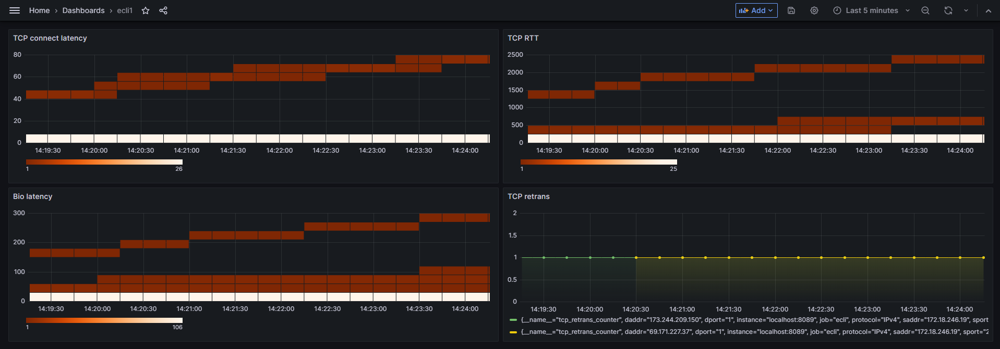

<h2>软件测试课设</h2>

[学习笔记](./notes) | [实验部分](./src)

## 实验内容

### 实施步骤

实现监控 agent 开发

### 前端要求

使用 vue 框架和 <del>element-ui 组件( 参考 vue-element-admin )</del> 咱用 antd 吧  (╯▽╰ )

### 数据来源

要求 1 和 3 实现得到

### 语言要求

C/Golang

### 实验要求

1. 基于 `ebpf` 对 linux 内核常规的指标进行监控

2. 需要收集该领域的相关研究前沿资料( word/ppt/pdf 等 )

3. 实现若干常规监控指标, 至少包括以下指标: `进程 tcp 建连耗时` `网络重传次数` `tcprtt` `biolatency`

4. 实现对监控指标的前端展示, 要具备选择展示的监控指标和观察的时间段

5. 监控指标可配置化, 可以通过配置文件指定既有指标, 也可以通过配置文件扩展新指标

6. 监控数据支持定制化落地到指定的数据库, 如 `Prometheus` `Elasticsearch` 等

7. 要求监控 `agent` 本身部署配置简单, 一个可执行文件和一个配置文件

### 验收标准

1. 需提交源码和代码运行视频

2. 提供设计资料, 使用说明, 接口说明, 部署说明, 当前问题以及后期优化

3. 实现满足需求, 且代码可稳定运行

## grafana 效果图

